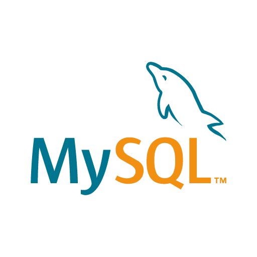

# Dynamic-Report-Generation-Using-Python-and-MySQL
A software to generate dynmaic reports using reportlab and MySQL database. GUI is also used using tkinter library. 

This software made by using-

1. Python 3.7.3

2. ReportLab 3.5.23

3. MySQL 5.5.16

4. Matplotlib 3.1.1'

